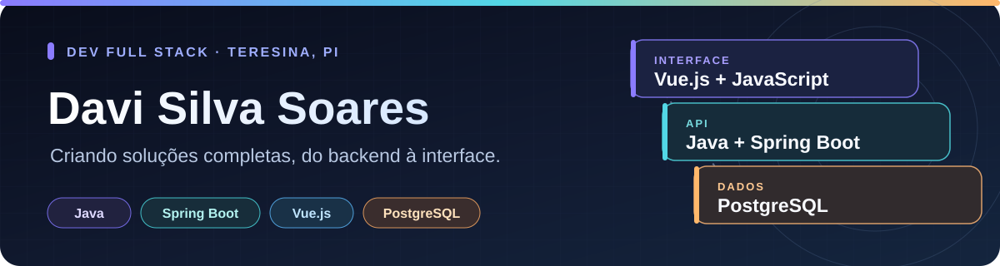

  

   

  
  
  

## 🙎🏻‍♂️ Sobre mim

Sou **Davi Silva Soares**, desenvolvedor full stack e estudante de **Engenharia de Software** em Teresina, Piauí. Meu foco é construir o backend com **Java e Spring Boot**, criar interfaces com **Vue.js, HTML, CSS e JavaScript** e conectar tudo a dados reais.

Nos projetos abaixo, trabalhei com APIs REST, autenticação, regras de negócio, painéis de indicadores e bancos relacionais. Gosto de transformar uma necessidade concreta em uma aplicação que faça sentido para quem vai usá-la.

Também estou estudando **Python e Django** para ampliar minhas possibilidades no desenvolvimento web.

## 💻 Tecnologias 

| Área | Ferramentas |
| --- | --- |
| **Backend** | Java, Spring Boot,Node.js, Express |
| **Frontend** | Vue.js, HTML5, CSS3, JavaScript,|
| **Dados e autenticação** | PostgreSQL, Supabase e JWT|
| **Integração e publicação** | APIs REST, Axios, Maven, Netlify |

## 🚀 Projetos em destaque

### 📅 [WS Agenda Online](https://github.com/dsoares22/ws_agenda)

Sistema de agendamento de atendimentos para a **WS Consultoria**, desenvolvido em equipe. Reúne login, rotas protegidas, cadastro e acompanhamento de visitas a clientes, além de um dashboard com indicadores.

`Vue 3` · `Pinia` · `Node.js` · `Express` · `Supabase/PostgreSQL`

**[Explorar o projeto →](https://github.com/dsoares22/ws_agenda)**

### ⚽ [API de Jogadores](https://github.com/dsoares22/api_jogadores)

Aplicação full stack para cadastrar, consultar e analisar jogadores de futebol. A API aplica regras para titularidade e classificação de desempenho a partir da média de gols por partida; a interface em Vue permite navegar e editar os dados.

`Java` · `Spring Boot` · `Spring JDBC` · `PostgreSQL` · `Vue 3`

**[Explorar o projeto →](https://github.com/dsoares22/api_jogadores)**

### 🌐 [Site WS Assessoria Comercial](https://github.com/dsoares22/Site-Wsconsultoria)

Site institucional responsivo para uma empresa de assessoria comercial e imobiliária. Apresenta serviços, inclui formulário de contato, mapa e acesso direto ao WhatsApp e Instagram.

`HTML5` · `CSS3` · `JavaScript` · `Netlify`

**[Ver o código →](https://github.com/dsoares22/Site-Wsconsultoria)** · **[Acessar o site →](https://wsassessoriacomercial.netlify.app/)**

### 📦 [EstoqueFácil](https://github.com/dsoares22/Estoquefacil)

Aplicação para controlar produtos e movimentações de estoque por empresa. Permite cadastrar e buscar produtos, registrar entradas e saídas, acompanhar estoque baixo e consultar o histórico. O backend usa autenticação com JWT.

`Java` · `Spring Boot` · `Spring Security` · `PostgreSQL` · `Vue 3`

**[Explorar o projeto →](https://github.com/dsoares22/Estoquefacil)**

---

  Entre em contato pelo <a href="mailto:davisilvasoares1@gmail.com">e-mail</a> ou pelo <a href="https://www.linkedin.com/in/davi-silva-soares-469b9235b/">LinkedIn</a>.

